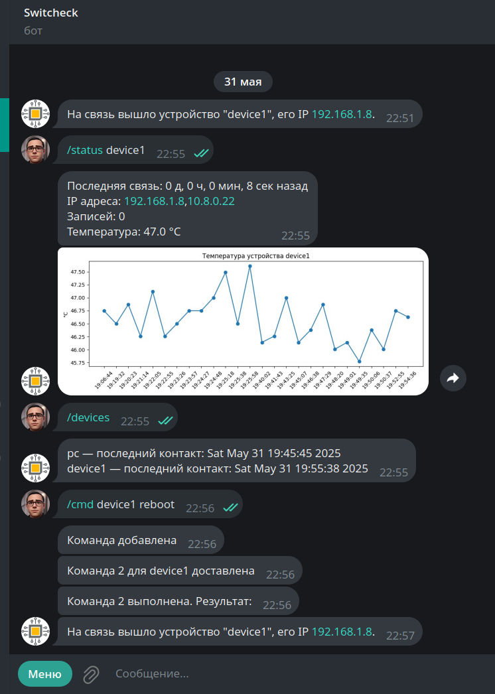

# Бот Switcheck

Предмет разработки: база данных для сбора результатов измерений электрической величины (в единицах АЦП, далее именуемые "Засечки") от устройств на базе Linux с пользовательским интерфейсом в виде бота Телеграм

# Описание

Чатбот + REST должны

1. Регистрировать устройства. Устройство обращается по http, имеет уникальный код. Пишет в БД свой. Бот обовещает администратора бота о выходе на связь устройства.

2. Принимать данные о засечках от устройств по http. В виде CSV фала со столбцами date TIMESTAMP, value LONGINT. В запросе приходит ID устройства. Пишет в все в БД

3. Принимает по REST Heartbeat чтобы показывать, что устройство в сети (по http) и его температуру, актуальный IP. Пишет в БД

4. От пользователя бота в телеграм:
- Список всех ID устройств и время последней связи с ними, температурау и график поcледних 1000 значений температуры с прореживанием 9 значений из 10. Показывать сколько сасечек  записано в БД от этого устройства.

- Команду удаления устройства из БД. Удаляет устройство и все связанные с ним записи.

- Команду bash для устройства с указанным ID. Пишет ее в базу со статусом "ожидание". Устройство при heartbeat забирает самую старшую команду из базы. Статус в базе меняется на "Доставлена".

По выполнении устройство по http присылает результат выполнения команды в виде строки и номером записи команды в базе. Статус ставится "Выполнена"

- Команду удаления bash команды из БД

При изменении статуса команды чатбот сообщает ее статус.

